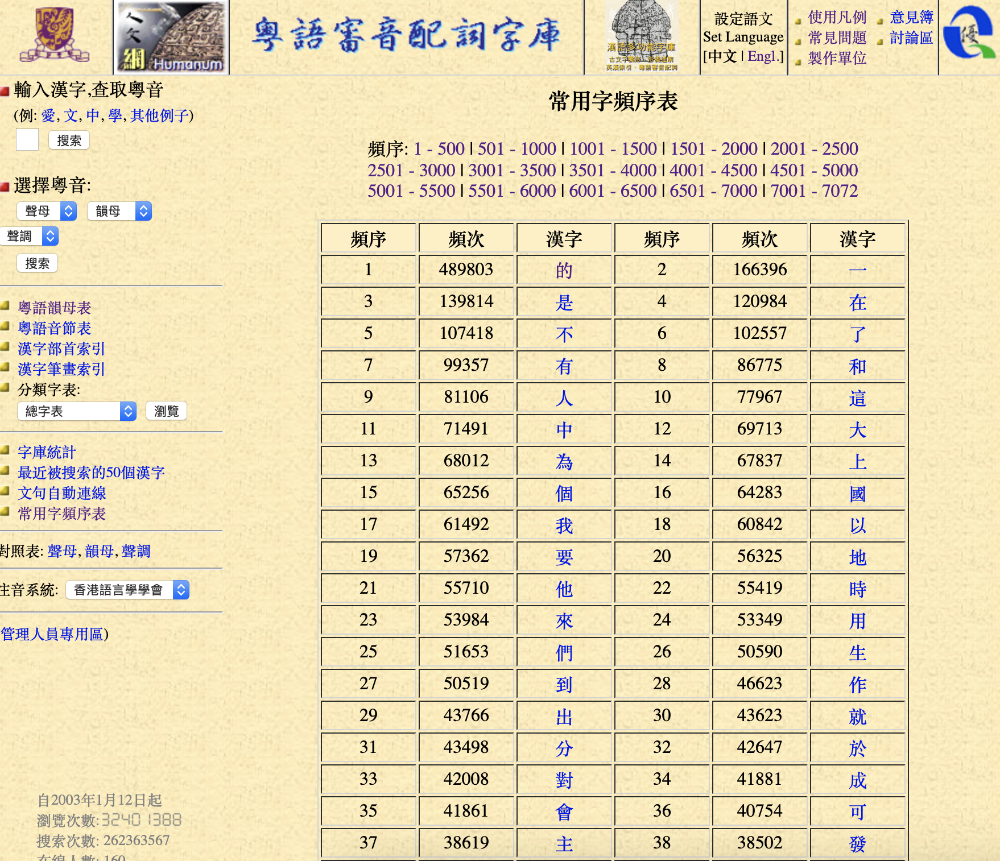
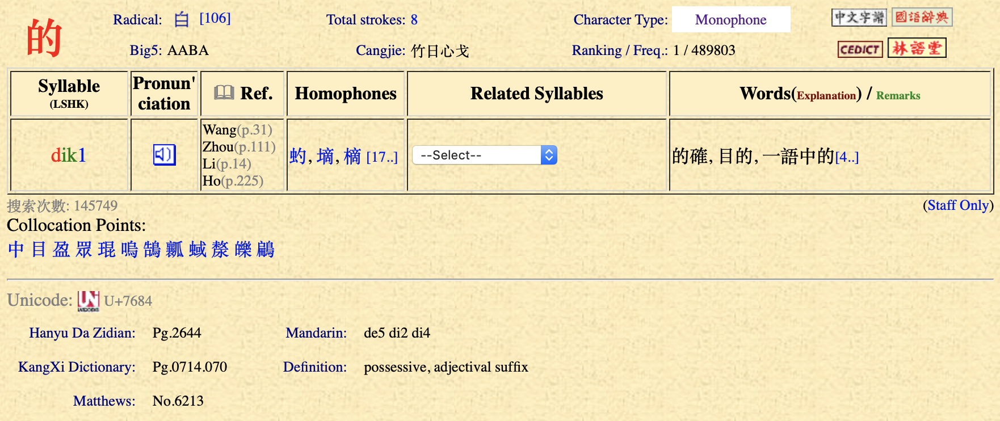

# Hong Kong Jyutping

This program crawls this [webpage](https://humanum.arts.cuhk.edu.hk/Lexis/lexi-can/) of Research Centre for Humanities Computing of Chinese University of Hong Kong to extract the pronunciation 7000 most frequestly used Cantonese words into a JSON file.

## What the webpage looks like

Overview



After clicking on a word:



## What the JSON file looks like
Note that one word can have multiple pronunciations
```json
{
  "不": [
      {
          "sound": "bat",
          "tone": 1,
          "examples": [
              "不然",
              "不離不棄",
              "一成不變"
          ]
      },
      {
          "sound": "fau",
          "tone": 2,
          "examples": []
      }
  ],
  "了": [
      {
          "sound": "laa",
          "tone": 1,
          "examples": []
      },
      {
          "sound": "liu",
          "tone": 4,
          "examples": []
      },
      {
          "sound": "liu",
          "tone": 5,
          "examples": [
              "了斷",
              "不得了",
              "沒完沒了"
          ]
      }
  ]
}
```

